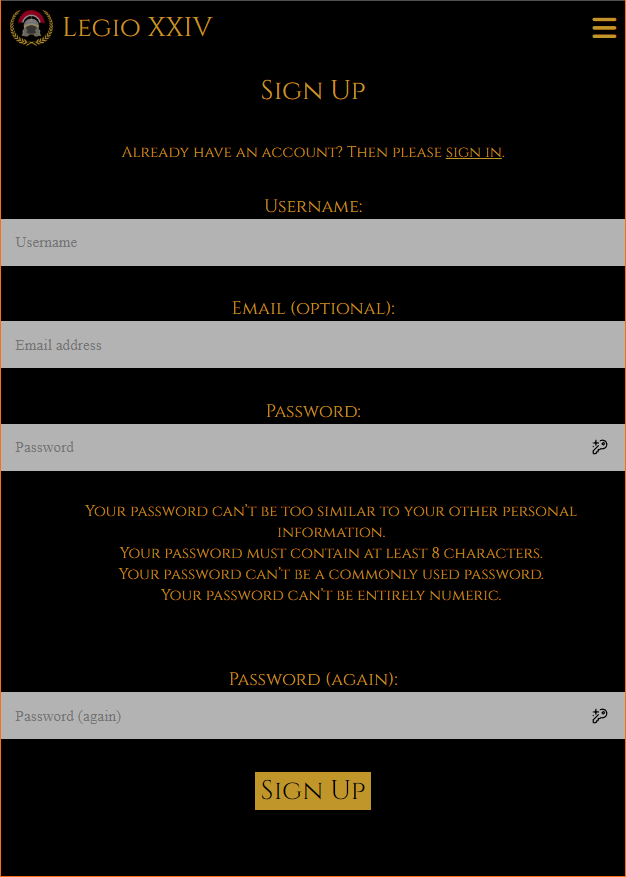

# Gaming Community Website

## Overview
[Deployed Project](https://jv-gaming-community-e5c0bcca0b46.herokuapp.com/)
### Purpose
My project involves the creation of a record keeping website for a gaming community. Its design is to facilitate storing of information about past events that the community has run and to help further immerse the players in the world of the game.
#### Target Audience
The target audience for my website is primarily for gaming community members looking to get more immersed in the world that is being created by the gaming community. It is also for community admins to have a record of what has been done previously and who was at what event to better facilitate creation of future events and stories.
## User Stories

### Must-Have User Stories
- As an Administrator I can use the admin panel so that I can manage users
	- Administrator can log in.  
	- Administrator can delete and create users.
- As a user I can sign up so that I have an account.
	- User can make an account  
	- User can change their password
- As a user I can make a mission report so that I can make mission reports
	- Mission report displays in mission reports 
	- Mission report can be approved by admins
	- Mission reports display correctly when approved
- As a user I can view the mission reports so that I can read them.
	- Mission reports display in a paginated format.  
	- User can view reports.
### Should-Have User Stories
- As a user I can open the mission reports page so that I can view players who attended and other details.
	- Mission page displays players who attended mission.  
	- Mission page displays mission report.
- As a User I can open a nicely styled mission editor so that it is easier to use
	- User can edit a mission without going into the admin panel.
	- Data is correctly loaded into form.
	- Editor is styled nicely in theme of the webpage.
	- Player can only edit the reports they themselves wrote.
### Could-Have User Stories
*Note: due to time constraints, none of the could-have user stories were implemented. I had to stop at MVP.*
- As a User I can Upload Images so that I can see them in the gallery
	- Image can be uploaded.  
	- Image needs to be approved by admin.  
	- Accepted image displays in gallery.
- As a user I can view the gallery so that I can see all the images.
	- User can open the gallery view.
	- Gallery view displays all approved images.
- As an Administrator I can accept and delete images so that the gallery can be curated
	- Administrator can accept posts.
	- Posts display correctly in the gallery.
	- Administrator can delete images.

## Project Board & Agile Development Practices
The implementation of Agile Development Practises was limited in this project due to the project duration only being one sprint long. Due to difficulties during the development period, some of the could-have user stories were not completed. Here is a link to the [Gaming Community Website Project Board](https://github.com/users/JamesVanstone/projects/2) which was used to track progress throughout the project, MoSCoW prioritization was used to ensure important features were prioritized.
As per the pillars of agile:
- Individuals over processes and tools. - Priority was put on seeking help when needed and going outside of the LMS to inform my development, rather than just doing things "by the book."
- Working software over comprehensive documentation - I prioritized getting the MVP of Create Request Update and Delete functionality on the web-page over writing the documentation, as working software is more important than comprehensive documentation.
- Customer collaboration over contract negotiation - I ensured that I had an open dialogue with my course facilitator in lieu of a customer, as this project is for the course. There wasn't really any contract negotiation.
- Responding to change over following a plan - I adapted my plan due to difficulties in developing during the first two weeks of the project, dramatically scaling back the scope of the project to ensure that MVP could be hit.
## Entity Relationship Diagram
Below is the Entity Relationship Diagram for my project. The Gallery model was not implemented due to time constraints, but I kept it in the ERD.

ERD Image

 

## Design Decisions
### Wireframes

Desktop Wireframes

Mobile Wireframes

From the beginning I decided to theme my website around a roman style. As such, I used the Cinzel font from google fonts as my headings font and for longer bits of text I used Times New Roman.
I selected a colour that looks nice on a black background, #c0952aff, and used it as the main colour throughout the website. I initially had some issues with contrast, but adding a dark black background with a high alpha value #000000dd for any boxes.
### Accessibility Considerations
Accessibility was taken into account at every stage of development. All non-background images have alt texts and the pages are structured in a sensible manner with elements properly navigable with keyboard only. The project passed the chrome dev tools lighthouse accessibility checker with a score of 100% and 95% on accessabilitychecker.org. The main colour were selected to have high contrast to the backgrounds it appears on. I checked the colours manually using the colour blindness simulator on [color-blindness.com](https://www.color-blindness.com/coblis-color-blindness-simulator/).

	
Accessibility Checks

Colour Blindness Tests

## Features Implementation
### Core Features (Must-Haves)

Admin panel

 
 

- As an Administrator I can use the admin panel so that I can manage users
	- All acceptance criteria implemented successfully.

Sign Up

 
 

- As a user I can sign up so that I have an account.
	- User is able to sign up.
	- User is not able to change their password without linking an email to their account. To change their password they have to use the reset password dialogue and put in their email. An admin should be able to change their password, but this isn't ideal. A better implementation would be good to have in the future where a user can edit their details from inside the website itself.

Create Report

 
 

- As a user I can make a mission report so that I can make mission reports
	- Users can make, edit, update, and delete missions. Missions must be approved by administrators before showing in the main mission list.

View Missions

 
 

- As a user I can view the mission reports so that I can read them.
	- The home page displays the last 3 mission report summaries. The missions page has a paginated (2 per page) display of all approved mission reports including mission date, location, pay, type, summary, and participants.

### Advanced Features (Should-Haves)

My Missions

 
 

- As a user I can open the mission reports page so that I can view players who attended and other details.
	- Dedicated missions page is implemented. Details are displayed. Player can see their own approved and unapproved reports in the "my missions" page while logged in.

Edit Missions

 
 

- As a User I can open a nicely styled mission editor so that it is easier to use
	- Editor is well styled and easy to use.
	- Editor is not rich-text.
	- New posts need approval, but due to an oversight users can edit approved posts and they will remain approved. This should be fixed in a later version.
### Optional Features (Could-Haves)
*Note: due to time constraints, none of the could-have user stories were implemented. I had to stop at MVP.*
- As a User I can Upload Images so that I can see them in the gallery
- As a user I can view the gallery so that I can see all the images.
- As an Administrator I can accept and delete images so that the gallery can be curated
## AI Tools Usage

### ChatGPT
ChatGPT was used to assist in my learning of Django. Anything the AI suggested was cross-referenced with the Django documentation and with the W3Schools Django documentation. I used ChatGPT for generating some mission reports.
## Testing and Validation
### Testing Results
Website is responsive and loads quickly, with a lighthouse performance score of 94%.

	
Lighthouse Performance

During the testing process, I found a number of issues that I rectified.
1. Images were in PNG format. Fixed by changing the background image and the logo image to .webp format.
There are other things that have been highlighted by the lighthouse performance checker that I do not have time to action.
1. Preconnecting google fonts origin
2. Resizing the logo image.
3. Not using fontawesome as their single icon I'm using for the burger menu is costing me 790ms.
4. Find some way to reduce the size of my background image.
I used the [amiresponsive tool](https://ui.dev/amiresponsive) to test the website.

amiresponsive result

### Validation
#### HTML W3C
Validating HTML is harder than validating CSS in django, as the django template language doesn't have an easily available validator online.
Instead, I am going to validate HTML by URL for the following URLs.
- `/` - Passed after issue with stray `</img>` tag fixed.
- `/missions`  - passed after issue with autoclosing stray `
` tag fixed.
None of the other URLs in the project are able to validated by URL due to authentication issues. For the other pages, I am using the browser's "view page source" and pasting it into the validator.
- Missions - Passed
- Sign In - Passed.
- Sign Up - Validator highlighted a number of issues in the source that are not actually present on manual inspection. This method of validation does not seem very good and I am stopping testing using it.
#### CSS W3C
During the validation process the validator highlighted one issue with the sign_style.css file where there was a `justify-content: self;` which is invalid. I fixed it.
Files Tested:
- style.css - Passed
- sign_style.css - Passed
- homepage_style.css - Passed
- missions_style.css - Passed
- crud_style.css - Passed
#### Python
I used the [Code Institute Python Linter](https://pep8ci.herokuapp.com/) to validate my python code. The only errors I got were "line too long" and "whitespace" errors. I went through and fixed all the pep8 whitespace and line too long errors in my python code.

CI python Linter Example

Before:

After:

#### Testing
|Test|Pass|
|----|----|
|User can log in|Pass|
|User can log out|Pass|
|User can sign up|Pass|
|Admin can view panel|Pass|
|Admin can add records in admin panel|Pass|
|Admin can edit records in admin panel|Pass|
|Admin can remove records in admin panel|Pass|
|User can view mission reports|Pass|
|User can view their mission reports|Pass|
|User can create new mission reports|Pass|
|User can edit existing mission reports|Pass|
|User can delete their mission reports|Pass|
|User cannot edit, update or delete their other user's reports|Pass|
|Missions page displays all mission details|Pass|
|Missions page sorts missions by date|Pass|
|Front page displays latest 3 missions by date|Pass|

## Deployment
### Deployment Process
For a short time I did not realise that deploying static files to Heroku required the use of a package called "whitenoise". It took some help from my peers to figure out that I was missing the package, but once it was added things worked well.
### Deployment Steps
1. Make an account on Heroku and redeem github student credits.
2. Start a project and go to the Deploy tab.
3. Select the "GitHub" deployment method.
4. Connect your github and select the gaming-community-website repo.
5. Go to the Settings tab and select Reveal Config Var
6. Add a SECRET_KEY config var, generated securely.
7. Add the DATABASE_URL config var with a link to the postgresql database.
8. Go back to the Deploy tab and go to Manual Deploy
9. Select "main" from dropdown and then click "Deploy Branch"
## Reflection on Development Process

### Final Thoughts
I found the project quite engaging once I was able to overcome my dificulties during week one and two of sprint 1. Some of it is a little rushed to meet the deadline, and I am keen to continue developing it in the future. I found the django documentation quite good and the w3schools django documentation was also useful. Many thanks to my facilitator Alex for his help and understanding, and to my fellow student Guy who helped me get the CRUD functionality implemented into my project.

## Code Attribution
A small amount of template code was used from the Code Institute LMS, as well as some limited use of the LMS as a learning resource. I found the LMS exceptionally difficult to use as a reference, so I avoided it wherever possible. Some code was copied in from the [Django documentation](https://docs.djangoproject.com/en/5.1/).

## Future Improvements
### Sprint 2
- I also want to implement the gallery I was unable to fit into sprint 1.
- In addition to this I would like to investigate why the HTML validator broke and fix it, but I didn't have time to do so in sprint 1.
- I would love to implement a user page so the user can edit their description and details and password without admin help.